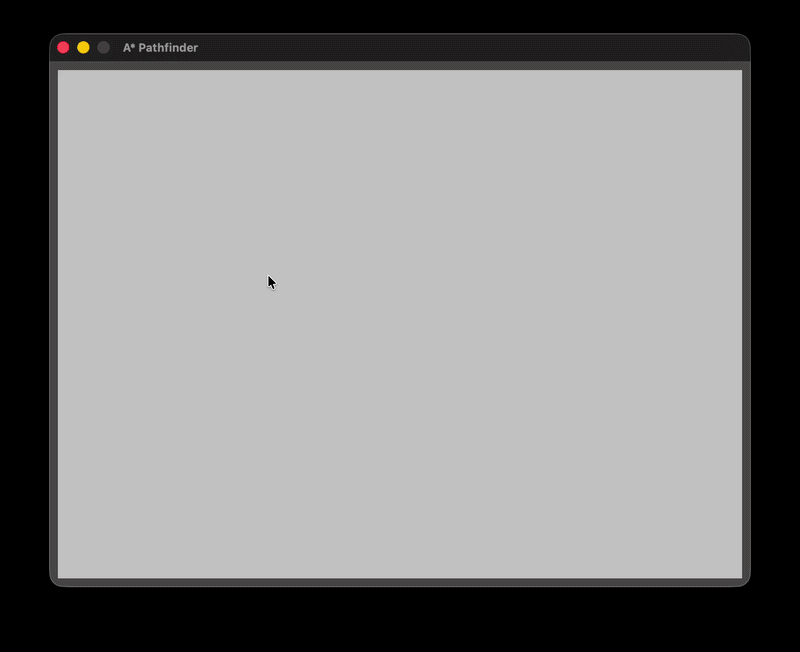

# ⭐️ A* Pathfinder Visualizer

A visual, interactive and real-time representation of the **A\*** Algorithm with **C++20** for the programming language, **CMake** for the compilation and **Raylib** for the graphic library.



## 🛠️ Technical caracteristics
- **Memory Architecture Optimized:** Use of a continious 1D `std::vector<Node>` for a cache friendly acces and maximal performance.
- **Modern C++20:** Use of modern functionnalities `concepts`, `std::format`, `std::optional` and strongly typed enumaration type (`enum class`)
- **Optimized sorting algorithm:** Use of `std::priority_queue` for the Open Set. It allows to sort the nodes when pushed and guarantee maximum efficiency.

## 🎮 Commands
| Actions | Command |
| :--- | :--- |
| **Choose Start** | First `left clic` |
| **Choose Target** | Second `left clic`|
| **Set Walls** | `Left clic` after choosing **Start** and **Target** |
| **Start the algorithm** | `S` after choosing **Start** and **Target** |
| **Restart** | `R` |

## 💻 Compilation and execution

### Prerequisites
- **C++20** compatible compiler (GCC 10+, Clang 11+, MSVC)
- **CMake** 3.2+

### Build CMake
```bash
git clone https://github.com/Kfnig24/AStar-Pathfinding.git
cd AStar-Pathfinding
mkdir build && cd build
cmake ..
make
./Pathfinder
```